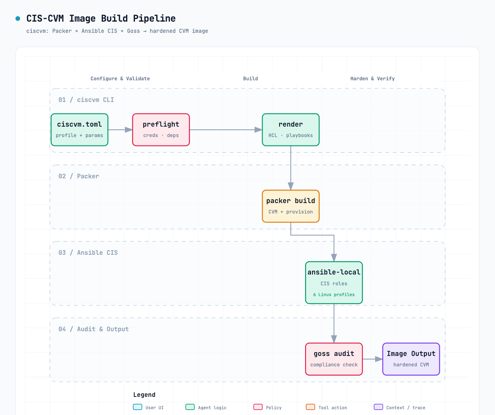

<p align="center">
  <b>English</b> | <a href="README.zh-CN.md">简体中文</a>
</p>

# ciscvm — Packer × Tencent Cloud CVM × CIS Image Builder

A single-command CLI tool that uses **Packer** to spin up a temporary Tencent Cloud CVM,
runs [ansible-lockdown](https://github.com/ansible-lockdown) CIS roles for system hardening
(remediation), then produces a CIS-compliant custom image (golden image).

- **Linux** (Ubuntu / RHEL / CentOS): hardening runs **inside** the instance via the
  `ansible-local` provisioner, and a **goss audit** acts as a build-time gate.
- **TencentOS 3 / 4**: uses a **custom CIS engine** (`cis_engine.py` + `rules.json`) bundled with
  the tool — no ansible-lockdown dependency; the compliance **gate is built into the Ansible role**
  itself (`cis_fail_on_findings`) so no separate goss audit is needed.
- **Windows Server** (2019 / 2022 / 2025, *preview*): uses **WinRM** + a remote `ansible` provisioner
  (Ansible runs on the controller, not in-VM); there is **no goss audit** on Windows — see
  [Windows Server](#windows-server-preview) for the verification approach.

The entire pipeline is driven by a **single config file** (`ciscvm.toml`). HCL / playbooks /
scripts are all rendered from config at build time — no hand-editing HCL required.

> **Default target:** Ubuntu 22.04 + CIS Level 1. See [Switching OS](#switching-os) below
> for other OS profiles (Ubuntu 24, RHEL 8/9, CentOS 8/9, TencentOS 3/4, Windows Server 2019/2022/2025) and levels.

## How it works



The dashed line splits **controller** (your machine / CI runner) from **CVM** (Packer-launched, ephemeral).
Everything is driven by one config: `ciscvm.toml`. The CLI just renders HCL/playbooks/scripts
into `.ciscvm-build/` and hands them to Packer. The box on the right (`hardened image`) is the output.

For Windows the only differences are: the CVM uses the WinRM communicator, ansible runs on the
**controller** (not in-VM), and there is no goss gate — the Windows CIS role is the audit.

## Project Structure

```
cis-cvm-image/
├── ciscvm.py                    # Tool itself (stdlib only, single file, run with python3)
├── README.md                    # This file (English)
├── README.zh-CN.md              # Chinese translation
├── LICENSE                      # MIT
├── ciscvm.toml                  # Config generated by `init` (single source of truth)
├── roles/
│   ├── cis_tencentos3/           #   Bundled CIS role for TencentOS 3 (see Switching OS)
│   └── cis_tencentos4/           #   Bundled CIS role for TencentOS 4
├── docs/
│   ├── ciscvm-pipeline.png      #   Static PNG embedded in this README
│   └── ciscvm-pipeline.svg      #   Editable source for the diagram above
└── .ciscvm-build/               # Rendered HCL/playbooks (gitignored)
```

## Prerequisites

1. **Python ≥ 3.11** (stdlib only, zero pip dependencies).
2. **[Packer](https://developer.hashicorp.com/packer/install)** ≥ 1.9 on the build machine.
3. A **sub-account** AK/SK with minimum permissions: `cvm:RunInstances`, `cvm:CreateImage`,
   `cvm:DescribeImages`, `cvm:CopyImage` (if using cross-region copy), plus image sharing
   permissions (if sharing). **Credentials go through environment variables only — never into any file:**

   ```bash
   export TENCENTCLOUD_SECRET_ID=AKIDxxxx
   export TENCENTCLOUD_SECRET_KEY=xxxx
   ```

4. A **dedicated build VPC + subnet + security group** (SG allows inbound port 22,
   restricted to your build machine's egress IP).
5. The official public image ID for **your chosen OS** (`source_image_id`). Find it in the
   Tencent Cloud Console → Images page, or via:

   ```bash
   tccli cvm DescribeImages --Filters '[{"Name":"image-type","Values":["PUBLIC_IMAGE"]}]'
   ```

## Usage

```bash
# 1. Generate sample config (writes ciscvm.toml + .gitignore)
python3 ciscvm.py init

# 2. Edit ciscvm.toml: pick a profile, fill in VPC / subnet / SG / source image ID;
#    credentials stay in env vars.

# 3. Pre-flight check (credentials / network / plugins / parameters ready?)
python3 ciscvm.py preflight

# 4. Validate only (render to .ciscvm-build/ then run packer init + validate)
python3 ciscvm.py validate

# 5. Build (produces image, auto-parses and prints the image ID)
python3 ciscvm.py build

# Optional: delete the render working directory
python3 ciscvm.py clean
```

Common flags: `--config <path>` (default `./ciscvm.toml`), `--workdir <dir>` (default `./.ciscvm-build`),
`--quiet` on `validate/build` (only show packer output).

After a successful build the image appears in the target region; if `image.copy_regions` is non-empty
it will be automatically replicated to other regions.

## Key Design Decisions

### 1. How CIS rules are applied

Packer's job is only: spin up VM → run provisioners → capture image. The actual hardening is done
by the `ansible-local` provisioner executing an `ansible-lockdown` CIS role inside the
temporary CVM, remediating rule-by-rule per CIS benchmark numbers.

We chose `ansible-local` (not `ansible`) so the Packer controller does **not** need SSH access
into the cloud VPC — playbooks and roles run entirely inside the instance.

### 2. Cloud environment exceptions (keep these, or you will lock yourself out)

The role variable **prefixes differ per OS** (e.g. `ubtu22cis_` for Ubuntu 22, `rhel9cis_` for
RHEL 9 — note Ubuntu is `ubtu`, not `ubuntu`). The rendered `ansible/site.yml` handles the
cloud exceptions that the tool manages automatically:

- **Boot / GRUB password is explicitly disabled** (`<role>_set_grub_user_pass: false` /
  `<role>_set_boot_pass: false`) so a misconfigured boot password can never lock the system.
- **For RHEL / CentOS**, the `rule_5_2_2` control ("disable root login") is turned **off** so the
  build-time shell provisioners can still reconnect over SSH after remediation.
- **For CentOS** (a RHEL derivative, not RHEL itself), `os_check` is set to `false` so the RHEL
  role does not abort on OS detection.
- `cloud-init` / IMDS controls are left at role defaults (not disabled).

> SSH **public-key** login is preserved by default because CIS keeps `PubkeyAuthentication yes`;
> the tool does not need a special "keep keys" toggle.

### 3. Build-time gate (fail if non-compliant)

`verify-cis.sh` runs a goss audit after hardening, parses failure count; if failures exceed
`cis.max_failures` (default 0) it exits 1, causing `packer build` to fail and preventing the
image from being stored. Audit directory defaults to `/opt/<role>_cis`; change `[cis].audit_dir`
in `ciscvm.toml` if your role version outputs elsewhere. (If the directory is missing the gate
soft-skips with a warning, so a wrong path never silently breaks the build — confirm the path
to make it a hard gate.)

### 4. Credentials / Network / Governance

- AK/SK via environment variables only (`sensitive = true`), never committed.
- Dedicated build VPC + SG; ephemeral instances are auto-recycled after build.
- Image name includes date and level; `image_tags` records CIS level / OS / benchmark for traceability.
- Cross-region via `image.copy_regions`; cross-account via `image_share_accounts` (share manually
  in console or via tccli after the tool outputs the image ID; downstream Terraform / Auto Scaling
  Groups reference it).

## Switching OS

The tool is **profile-driven**: HCL / playbooks / scripts are all rendered from config — switching OS
requires only changing a config value or adding one dictionary entry in `ciscvm.py`.

### Built-in Profiles

| profile | OS | Role | Login | Status |
|---|---|---|---|---|
| `ubuntu22` | Ubuntu 22.04 | `ansible-lockdown.ubuntu22_cis` | ubuntu (ssh) | Fully supported (verified) |
| `ubuntu24` | Ubuntu 24.04 | `ansible-lockdown.ubuntu24_cis` | ubuntu (ssh) | Preview* |
| `rhel8` | RHEL 8 | `ansible-lockdown.rhel8_cis` | root (ssh) | Preview* |
| `rhel9` | RHEL 9 | `ansible-lockdown.rhel9_cis` | root (ssh) | Preview* |
| `centos8` | CentOS 8 (maps to RHEL 8 role) | `ansible-lockdown.rhel8_cis` | root (ssh) | Preview* |
| `centos9` | CentOS 9 (maps to RHEL 9 role) | `ansible-lockdown.rhel9_cis` | root (ssh) | Preview* |
| `windows2019` | Windows Server 2019 | `Windows-2019-CIS` | Administrator (WinRM) | Preview** |
| `windows2022` | Windows Server 2022 | `Windows-2022-CIS` | Administrator (WinRM) | Preview** |
| `windows2025` | Windows Server 2025 | `Windows-2025-CIS` | Administrator (WinRM) | Preview** |
| `tencentos3` | TencentOS Server 3 | **bundled** `cis_tencentos3` (cis_engine.py) | root (ssh) | Preview† |
| `tencentos4` | TencentOS Server 4 | **bundled** `cis_tencentos4` (cis_engine.py) | root (ssh) | Preview† |

\* Role names and variable prefixes are verified against the ansible-lockdown source, but not yet
run end-to-end on Tencent Cloud. Treat as preview: double-check `[cis].audit_dir` for your role
version, and pin `role_version` once validated.
\** Windows support is architecturally different (WinRM + remote `ansible`, no in-VM ansible,
no goss audit). The WinRM provisioner wiring and the L1/L2 member-server variables
(`win22cis_l1_ms` / `win19cis_l1_ms`) must be validated against a real Windows build — see below.
† TencentOS uses a **custom CIS engine** from [susunola/cis-os](https://github.com/susunola/cis-os):
the `cis_tencentos3` / `cis_tencentos4` role directories are bundled in `roles/`, no
ansible-galaxy download. The compliance gate is `cis_fail_on_findings` inside the role;
there is no goss audit step. Set `cis_mode: apply`, `cis_profile: L1` or `L2` via level config.

### Case A: Use a built-in profile

Change one line in `ciscvm.toml`:

```toml
[build]
profile         = "rhel9"                            # switch to built-in profile name
source_image_id = "img-realRhel9PublicImageID"       # must use the actual OS public image ID
```

SSH user, CIS role name, package manager, audit directory etc. are all carried by the profile —
auto-rendered, no other changes needed.

### Case B: Brand new OS (not built-in)

Add an entry to the `PROFILES` dictionary in `ciscvm.py`, then use its key in `ciscvm.toml`.
Template (RHEL-family example; drop `os_check_var` / `root_login_rule_var` for non-RHEL;
see existing `windows2019`/`windows2022`/`windows2025` entries in `PROFILES` for the Windows template):

```python
"almalinux9": {
    "ssh_username": "root",
    "role": "ansible-lockdown.rhel9_cis",        # exact name on Ansible Galaxy
    "role_version": "",                          # "" = latest; pin a version for reproducibility
    "audit_dir": "/opt/rhel9_cis",               # must match role's audit output directory
    "os_tag": "almalinux-9",
    "benchmark": "CIS-v2.0.0",
    "pkg_update": "sudo dnf makecache",
    "pkg_install": "sudo dnf install -y python3-pip git",
    "clean_cmd": "sudo dnf clean all",
    "level1_var": "rhel9cis_level_1",            # level variable prefix varies by role
    "level2_var": "rhel9cis_level_2",
    "boot_pass_var": "rhel9cis_set_boot_pass",   # explicitly disable boot/GRUB password
    "os_check_var": None,                         # None = don't set (only for RHEL-derivatives)
    "root_login_rule_var": "rhel9cis_rule_5_2_2",# keep root SSH on for build-time connect
    "preview": True,                             # set True until manually verified
},
```

Then set `profile = "almalinux9"` in `ciscvm.toml`.

### Three things MUST align with the real role (or hardening/audit silently fails)

1. **Role name + version** (exact spelling on `ansible-galaxy`; fall back to
   `git+https://github.com/ansible-lockdown/<REPO>.git` if a Galaxy version doesn't exist).
2. **Level variable prefix** (`ubtu22cis_` / `rhel9cis_` etc. — **Ubuntu is `ubtu`, not `ubuntu`**;
   check the role's `defaults/main.yml`).
3. **Audit output directory** (`audit_dir`, i.e. `[cis].audit_dir` in `ciscvm.toml`).

### Switching CIS Level

Set `[cis].level = 2`. Note that **Level 2 requires extra partitions**
(`/var`, `/var/tmp`, `/var/log`, `/var/log/audit`, `/home` with `nodev/nosuid/noexec`),
which public images don't satisfy by default — partition first in the source image or via `user_data`
before building.

After that: `preflight` → `validate` → `build` as usual.

## Windows Server (preview)

Windows images can't use `ansible-local` / SSH, and there is **no goss audit** on Windows.
The tool therefore renders a **different pipeline** for `windows2019` / `windows2022` / `windows2025`:

| | Linux | Windows |
|---|---|---|
| Communicator | SSH | **WinRM** (`communicator = "winrm"`) |
| Provisioner | `ansible-local` (in-VM) | `ansible` (remote, controller → guest over WinRM) |
| Role install | inside the temp CVM (`install-ansible.sh`) | **on the controller** before `packer build` (auto `ansible-galaxy role install git+…`) |
| Build-time gate | goss audit (`verify-cis.sh`) | **none** (see verification below) |
| Level selection | `<role>_level_1/2` + `--tags` | member-server vars `win22cis_l1_ms` / `win19cis_l1_ms` |

### How to build a Windows CIS image

```toml
[build]
profile         = "windows2022"
source_image_id = "img-realWindows2022PublicImageID"

[cloud]
winrm_password_env = "WINRM_PASSWORD"   # Windows admin password (env var name)
```

```bash
export TENCENTCLOUD_SECRET_ID=AKIDxxxx
export TENCENTCLOUD_SECRET_KEY=xxxx
export WINRM_PASSWORD='<Windows Administrator password meeting complexity>'
# controller must have ansible + pywinrm:
pip install 'ansible' pywinrm
python3 ciscvm.py preflight && python3 ciscvm.py build
```

The rendered `ansible/site.yml` sets `win22cis_ansible_remediation: true` /
`win22cis_create_gpos: false` (GPO / domain vars stay off for a standalone golden image) and the
member-server Level via `win22cis_l1_ms: true` (`l2_ms` for Level 2). WinRM is **never disabled**
by the hardening — disabling it would break the provisioner connection.

### Verification (no goss on Windows)

Because goss doesn't run on Windows, the build-time gate is **not applied** for Windows. Verify
compliance **after** the image is built, out-of-band:

- Run **Microsoft Policy Analyzer** or **CIS-CAT Pro** against the produced image, or
- Use the role's own reporting (set `win22cis_run_audit` / section-based checks per your role version).

Until a real Windows build validates the WinRM wiring and the L1/L2 member-server variables,
treat `windows2019` / `windows2022` / `windows2025` as **preview** and confirm them against the role's
`defaults/main.yml`.

## CI Integration

In CNB / Gongfeng pipelines: `export` credentials → `python3 ciscvm.py build`,
then downstream CVM / Auto Scaling Group / Terraform references the resulting `image_id`.
Recommend pinning the build machine to a dedicated VPC + SG.

## License

MIT
